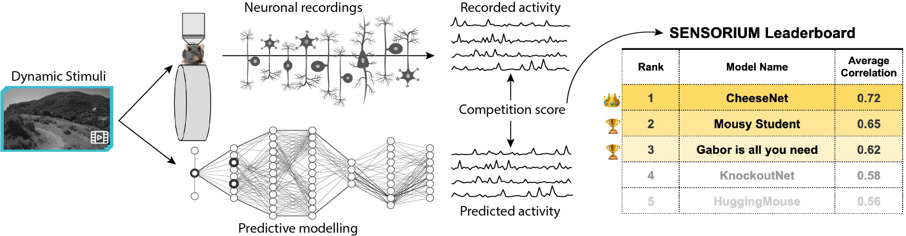

<a href="https://github.com/psf/black"></a>
[](https://github.com/activeloopai/Hub)

# SENSORIUM 2023 Competition


SENSORIUM is a competition on predicting large scale mouse primary visual cortex activity. We will provide large scale datasets of neuronal activity in the visual cortex of mice. Participants will train models on pairs of natural stimuli and recorded neuronal responses, and submit the predicted responses to a set of test images for which responses are withheld. 

In 2022 we used images as stimuli, in 2023 we add the time component and use videos.

Join our challenge and compete for the best neural predictive model!

For more information about the competition, vist our [website](http://sensorium-competition.net/).

<!-- Have a look at our [White paper on arXiv](https://arxiv.org/abs/2206.08666), which describes the dataset and competition in detail. -->

The White paper, which describes the dataset and competition in detail will be pubished later./

# Important Dates
**June 12, 2023**: Start of the competition and data release.
<br>**Oct 15, 2023**: Submission deadline.
<br>**Oct 17, 2023**: Validation of all submitted scores completed. Preliminary winners are announced. Rank 1-3 in both competition tracks are contacted to provide the code for their submission.
<br>**Oct 27, 2023**: Deadline for top-ranked entries to provide the code for their submission for validation.
<br>**Oct 30, 2023**: Winners annonced and contacted to contribute to the competition summary write-up.

# Starter-kit

This is a starter kit repo. The links for data would be published upon the competition start. Participants would have access to zip archieves or to the Deep Lake dataloaders, not to store the datasets locally.

To use the conda environment please do the following:
```
conda env create -f env.yml
conda activate sensroium_2023
```

We provide notebooks that illustrate the structure of our data, our baselines models, and how to make a submission to the competition.
<br>[**Dataset tutorial**](notebooks/load_data_demo.ipynb): Shows the structure of the data and how to turn it into a PyTorch DataLoader.
<br>[**Model tutorial**](notebooks/models_demo.ipynb): Provides introduction to the different models
<br>[**Benchmark training**](notebooks/benchmarks_training.ipynb): How to train and evaluate our baseline models.
<!-- <br>[**Submission tutorial**](notebooks/submission_tutorial/): Use our API to make a submission to our competition. -->
**To download data as .zip, click [here](https://gin.g-node.org/pollytur/sensorium_2023_dataset)**

## Submission comments

Due to file size restrictions the submission for main track and bonus track differ slightly.

**Main track:** Participants should submit a zip file with two files in it : `predictions_live_main.parquet.brotli` and `predictions_final_main.parquet.brotli` for the live and final test, respectively. These two files should be directly in the zip file and **not** be zipped with any folders in between. 

**Bonus track:** For the bonus track please name the prediction files like this: `predictions_live_test_bonus_ood.parquet.brotli` and `predictions_final_test_bonus_ood.parquet.brotli`. Please zip files for both `live` and `final` submissions separately and upload them separately for the two different competition stages (`live` and `final` tabs on the submission page). We need to do this to avoid uploading files over 5 GB.

If you do not want to use our API for the competition submission, here are some guidelines: Each file should contains four columns: `mouse` with the session name, `trial_indices` (like '1.npy'), `prediction`, where each entity in the predictions column is a list of lists with shape = (number or neurons, n_frames), where n_frames is the last n_frames frames for the video, excluding the first 50 frames (like for 300 frames in video we need predictions only for the last 250), and  `neuron_ids`, which is simply the order of the neurons in the predictions. 

If you use pandas, here is a toy example how to save the data:

```
data = [
    ('mouse1', '1.npy', np.random.random((8000, 250)).tolist(), [1,2,3]),
    ('mouse1', '2.npy', np.random.random((8000, 250)).tolist(), [1,2,3]),
    ('mouse1', '3.npy', np.random.random((8000, 250)).tolist(), [1,2,3]),
]


df = pd.DataFrame.from_records(data, columns=['mouse', 'trial_indices', 'prediction', 'neuron_ids'])
df = pd.concat(dataframes_pred, ignore_index=True)
submission_filename = f"predictions_file_{tier}_{track}_track.parquet.brotli"
save_path = os.path.join(path, submission_filename) if path is not None else submission_filename
df.to_parquet(save_path, compression='brotli', engine='pyarrow', index=False)
```

If you have any questions, feel free to reach out to us (Contact section on our [website](http://sensorium-competition.net/)), or raise an issue here on GitHub!
## Cite
If you are using the dataset, code and/or winners suggestions, please cite the whitepaper and/or the competition retrospective.  
[Whitepaper](https://arxiv.org/abs/2305.19654)
```
@misc{turishcheva2024dynamicsensoriumcompetitionpredicting,
      title={The Dynamic Sensorium competition for predicting large-scale mouse visual cortex activity from videos}, 
      author={Polina Turishcheva and Paul G. Fahey and Laura Hansel and Rachel Froebe and Kayla Ponder and Michaela Vystrčilová and Konstantin F. Willeke and Mohammad Bashiri and Eric Wang and Zhiwei Ding and Andreas S. Tolias and Fabian H. Sinz and Alexander S. Ecker},
      year={2024},
      eprint={2305.19654},
      archivePrefix={arXiv},
      primaryClass={q-bio.NC},
      url={https://arxiv.org/abs/2305.19654}, 
}
```
[Retrospective](https://arxiv.org/abs/2407.09100)
```
@misc{turishcheva2024retrospectivedynamicsensoriumcompetition,
      title={Retrospective for the Dynamic Sensorium Competition for predicting large-scale mouse primary visual cortex activity from videos}, 
      author={Polina Turishcheva and Paul G. Fahey and Michaela Vystrčilová and Laura Hansel and Rachel Froebe and Kayla Ponder and Yongrong Qiu and Konstantin F. Willeke and Mohammad Bashiri and Ruslan Baikulov and Yu Zhu and Lei Ma and Shan Yu and Tiejun Huang and Bryan M. Li and Wolf De Wulf and Nina Kudryashova and Matthias H. Hennig and Nathalie L. Rochefort and Arno Onken and Eric Wang and Zhiwei Ding and Andreas S. Tolias and Fabian H. Sinz and Alexander S Ecker},
      year={2024},
      eprint={2407.09100},
      archivePrefix={arXiv},
      primaryClass={q-bio.NC},
      url={https://arxiv.org/abs/2407.09100}, 
}
```
